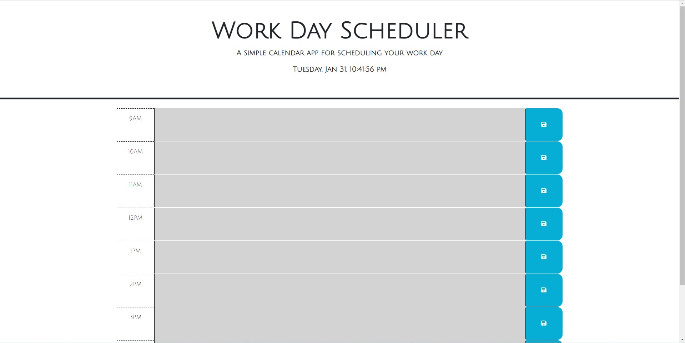

# 05 Third-Party APIs: Work Day Scheduler

## Description

This simple work day calendar allows you to schedule and save specific events from 9 AM to 5 PM. These events are logged in the local storage then set in the corresponding time block. Day.js is used to provide the current date and time in the header, and the time blocks change color based on the current hour. It does this by parsing the integers of the time block and the current hour, and compares those values to provide the color. 

## Preview of Deployed Application

* This preview of the application shows the scheduler with the date and time in the header. The background color of the time blocks are set to gray when the hour is in the past. If the time block matches the current hour, the time block will be red. If the time block is in the future relative to the current hour, the time block will be green.

# Deployed Page URL

*